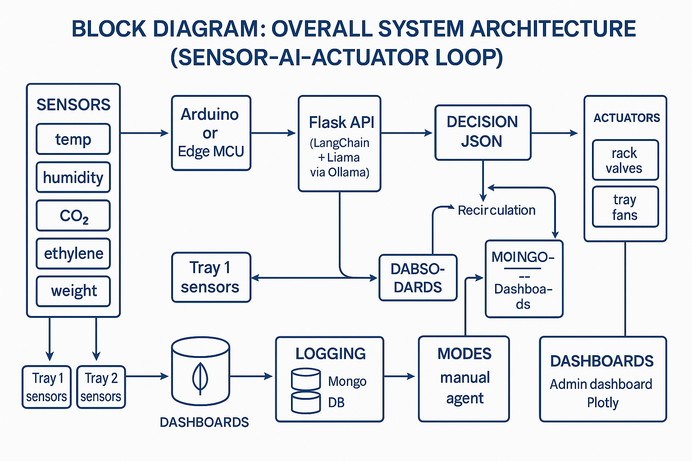
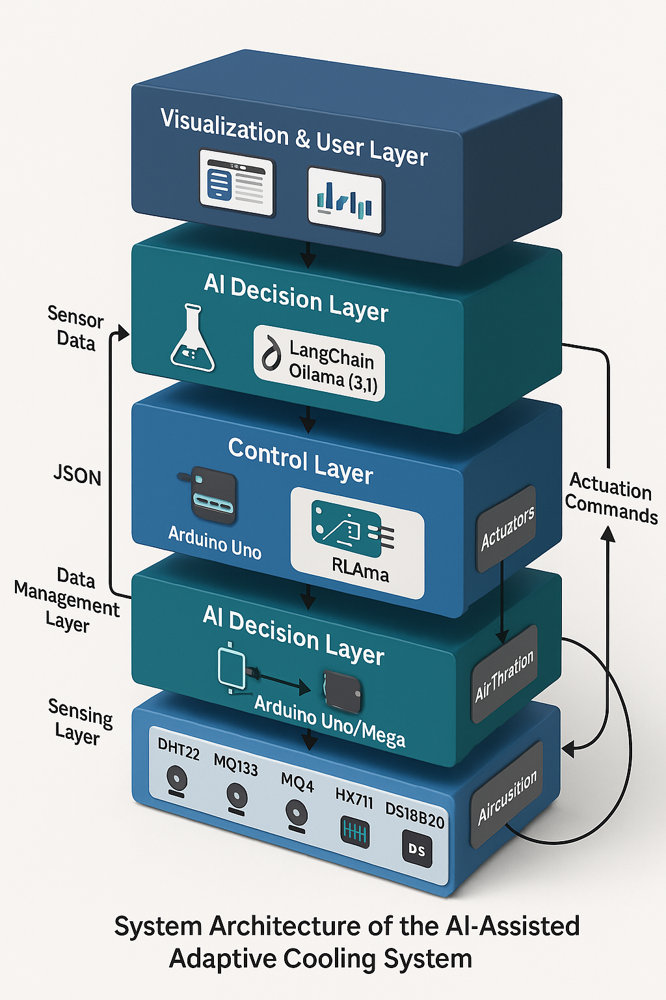
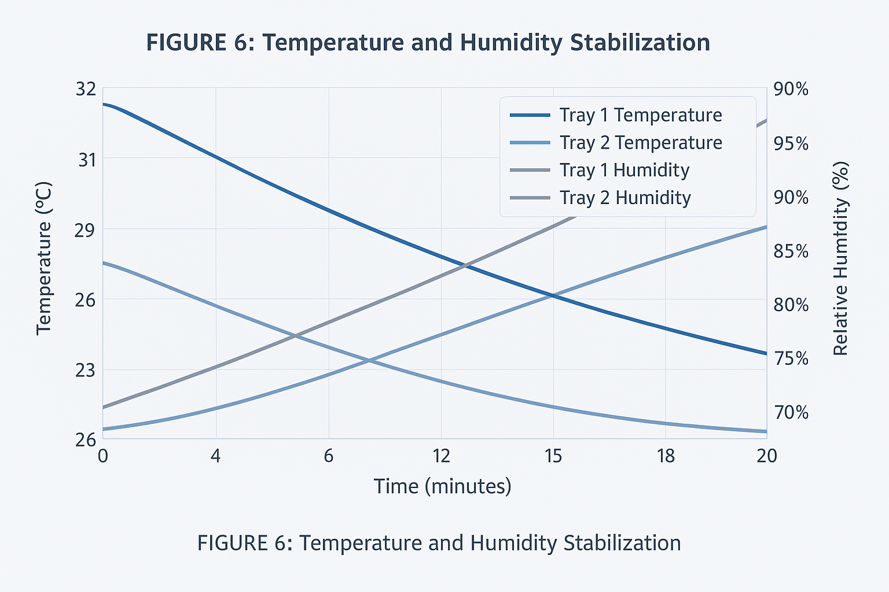
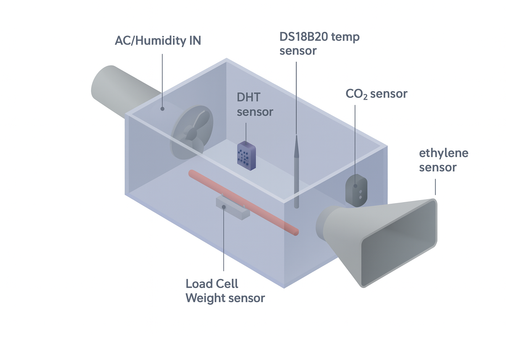

# AI-Assisted Adaptive Cold Storage System  
### Multi-Zone Cooling, Preservation Intelligence & Sensor-Driven Automation

This project implements an **AI-Assisted Adaptive Cooling and Preservation Control System** for multi-zone cold storages.  
Each storage tray/zone uses its own sensor cluster and adaptive control loop.  
The backend integrates **LangChain + Llama3.1**, a **Flask API**, **Plotly dashboards**, and **Arduino-based actuation**.  

The system intelligently adjusts cooling, humidity, airflow, and gas filtration based on real-time data, historical patterns, and commodity-specific preservation models.

---

# 📌 Key Objectives

- Reduce spoilage through zone-wise environmental control  
- Provide commodity-specific optimal conditions  
- Maintain stability across temperature, humidity, CO₂, ethylene, and weight loss  
- Enable a full **Sensor → AI → Actuator** closed loop  
- Support manual + AI-agent modes  
- Provide real-time dashboards for operators  

---

# 🧠 System Description (Detailed)

Cold storages normally use a **single global temperature/humidity setting**, regardless of the product stored.  
This causes:

- Over-cooling sensitive items  
- Under-preserving high-respiration produce  
- Accelerated spoilage and texture degradation  
- Wasted energy due to uniform, non-adaptive cooling  

This system introduces **multi-zone intelligence**, where each tray is treated as an independent micro-environment.  

### **Every tray includes:**

- **Temperature sensors** (DHT22, DS18B20)  
- **Humidity sensors**  
- **Ethylene sensors (MQ-series)** for ripening detection  
- **CO₂ sensors** for respiration/fermentation  
- **Load cell (HX711)** to track product weight loss over time  

### **AI-Assisted Decision Layer**

The backend (Flask API) collects sensor data → the LLM agent (Ollama Llama-3.1) recommends or sets:

- Target temperature  
- Target humidity  
- Air circulation speed  
- Valve positions  
- Filtration + recirculation timing  

The system supports:

- **Manual mode** (operator controls actuators directly)  
- **AI mode** (agent computes decisions in JSON)  

Both modes are unified in a predictable control loop.

---

# 🔥 System Architecture (Block Diagrams & Workflow)

### **High-Level Block Diagram**

---

### **Overall System Architecture**

---

### **Data Flow Diagram**

---

# 🧪 Experimental Validation

### **Temperature & Humidity Stabilization**
The multi-zone adaptive loop stabilizes trays at different setpoints depending on commodity requirements.

This demonstrates how **Tray 1** and **Tray 2** converge to different environmental profiles over a 20-minute cycle.

---

# 🧱 Hardware Architecture

### **Sensor Layout (per tray)**

Includes:

- DHT22 (Temp/Humidity)  
- DS18B20 (Precision temp)  
- MQ sensors (ethylene & CO₂)  
- Load cell + HX711 (weight tracking)  
- Airflow fan & recirculation blower  
- AC/Humidity inlet  

---

# 🧩 Software Architecture

### **Backend**
- Python 3.x  
- Flask API (`backend/app.py`)  
- Plotly dashboard (`plotly_app.py`)  
- MongoDB for real-time sensor logging  
- LangChain pipeline for reasoning  
- Ollama Llama 3.1 for agentic decision generation  

### **Frontend**
- HTML/JS dashboard (`dashboard/index.html`)  
- Plotly graphs for real-time visualization  

### **Microcontroller Layer**
- Arduino Uno / Edge MCU  
- Serial-based data exchange  
- PWM control for fans and valves  
- Relay control for humidity/AC units  

---

# ⚙️ Installation & Setup  
These steps assume a **Windows** environment.

---

## **1️⃣ Start MongoDB**

mongod

## **2️⃣ Pull Llama 3.1 into Ollama**

ollama pull llama3.1

## **3️⃣ Start Plotly Dashboard (Terminal 1)**

cd backend
plotlyy/Scripts/activate       # activate plotly environment
cd ..
python plotly_app.py

## **4️⃣ Start Backend API (Terminal 2)**

cd backend
.venv/Scripts/activate         # main backend environment
cd ..
python -m backend.app

IMPORTANT:
Use the link printed in terminal to open the dashboard.
Always open the portal exactly from the URL printed in Terminal 2,
because the backend dynamically generates the serving port.

## **5️⃣ Start Frontend Dashboard**

Open manually:

dashboard/index.html → Right click → Open with Live Server / Browser

🧠 Working Modes

Manual Mode

- Operator sends actuator commands from dashboard UI
- API forwards commands directly to controller
- Arduino executes commands via PWM/relays

AI Mode

- Dashboard requests "decision JSON" from agent
- Llama 3.1 generates tray-wise instruction JSON
- API validates & forwards commands
- Controller applies actuator state
- Changes logged into MongoDB

🧑‍💻 Author

Ganesh Maharaj Kamatham
B.Tech CSE (Data Science), VIT Vellore

📜 License

This project is for research and prototyping.
Commercial deployment requires permission.

